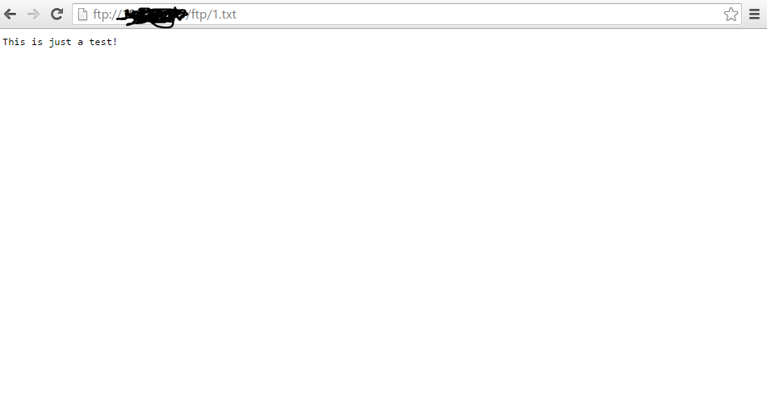

FTP Server
==========

FTP or File Transfer Protocol is TCP based service. We use FTP to upload or download their files to server. By default FTP use 2 ports, which is port 20 and 21. Port 21 for "command port" and port 20 for "data port".

In this documentation we use Ubuntu 14.04 as operating system, and vsftpd as ftp server.

- root access
::

	  sudo su
- Re-synchronize the package index files from sources 
::

      apt-get update
   
- Install vsftpd
::

      apt-get install vsftpd

- Add user id & password to access ftp
::

      adduser cnc
.. image:: /images/adduser.png

- Edit configuration file
::

      nano /etc/vsftpd.conf
.. image:: /images/vsftpd.png

- Find these parameters and set them to :
::

      anonymous_enable=NO
::

      local_enable=YES
::

      write_enable=YES
::

      chroot_local_user=YES

- Changing ownership root for cnc directory
::

	  sudo chown root:root /home/cnc

- Creating directory for ftp files
::

	  sudo mkdir /home/cnc/ftp

- Granting access to user cnc that we created before to access ftp directory
::

	  sudo chown cnc:cnc /home/cnc/ftp
- For a test, create a txt file named 1.txt inside  /ftp directory, and write as you like, mine was "This is just a test!"
::

	  nano /home/cnc/ftp/1.txt

Now you can access your ftp server by opening your web browser and type ftp:// (your ftp server ip)

.. note::

		Login using username and password that we set before