Network Simulator 2 Installation (NS2)
======================================

.. sidebar:: Documented by :

     * **Code Name**    : NDA
     * **Date** 	: 12/18/2015
     * **Mail** 	: naufal.itt@gmail.com

Ns is a discrete event simulator targeted at networking research. Ns provides substantial support for simulation of TCP, routing, and multicast protocols over wired and wireless (local and satellite) networks.[1] 

You can download ns2 files from `<http://sourceforge.net/projects/nsnam/files/allinone/>`_.
In this documentation we use Ubuntu 10.04 32bit as operating system. You can download iso file from `<http://old-releases.ubuntu.com/releases/lucid/ubuntu-10.04-desktop-i386.iso>`_

**1. NS 2.35**
*************

- Root access
::

	sudo su

- Re-synchronize the package index files from sources 
::

  apt-get update

- Extract the tar.gz file
::

  tar -xvf ns-allinone-2.35.tar.gz 

.. note::

    Check the directory which ns-allinone-2.35.tar.gz downloaded 

- Install packages
::

  sudo apt-get install build-essential autoconf automake libxmu-dev

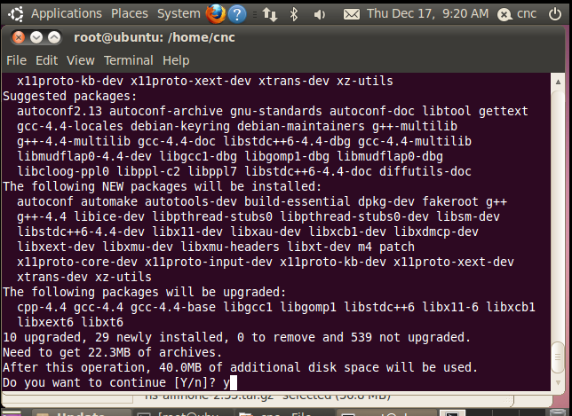

- Move to ns2 directory
::
  
  cd /home/cnc/ns-allinone-2.35 

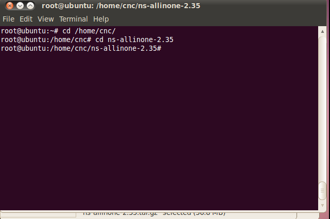

.. note::

    Check your own path, in this documentation we use /home/cnc/ 

- Install ns2
::

  ./install

- When the installation succed it will be like this

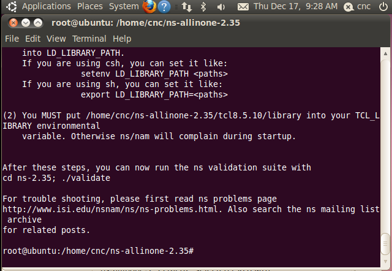

- Edit bashrc
::

  nano ~/.bashrc

- Add this to bashrc
::

  # LD_LIBRARY_PATH
  OTCL_LIB=/home/cnc/ns-allinone-2.35/otcl-1.14
  NS2_LIB=/home/cnc/ns-allinone-2.35/lib
  X11_LIB=/usr/X11R6/lib
  USR_LOCAL_LIB=/usr/local/lib
  export LD_LIBRARY_PATH=$LD_LIBRARY_PATH:$OTCL_LIB:$NS2_LIB:$X11_LIB:$USR_LOCAL_LIB
  # TCL_LIBRARY
  TCL_LIB=/home/cnc/ns-allinone-2.35/tcl8.5.10/library
  USR_LIB=/usr/lib
  export TCL_LIBRARY=$TCL_LIB:$USR_LIB
  # PATH
  XGRAPH=/home/cnc/ns-allinone-2.35/bin:/home/cnc/ns-allinone-2.35/tcl8.5.10/unix:/home/cnc/ns-allinone-2.35/tk8.5.10/unix
  NS=/home/cnc/ns-allinone-2.35/ns-2.35/
  NAM=/home/cnc/ns-allinone-2.35/nam-1.15/
  PATH=$PATH:$XGRAPH:$NS:$NAM

- Source
::

  source ~/.bashrc

- check ns-ver
::

  ns

  ns-ver

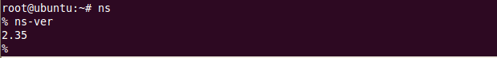

- Download and run simple script from http://nile.wpi.edu/NS/Example/ns-simple.tcl
::

  ns ns-simple.tcl

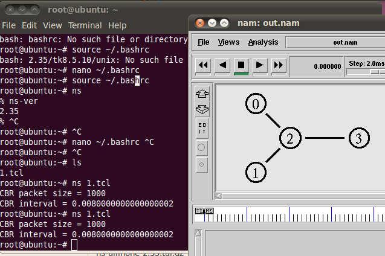
 

**2. NS 2.34**
*************

- Root access
::

	sudo su

- Re-synchronize the package index files from sources 
::

      apt-get update	

- Extract the tar.gz file
::

  tar -xvf ns-allinone-2.34.tar.gz 

.. note::

    Check the directory which ns-allinone-2.34.tar.gz downloaded 

- Install packages
::

  sudo apt-get install build-essential autoconf automake libxmu-dev

- Open file in otcl-1.13/configure
::

  nano +6304 /home/cnc/ns-allinone-2.34/otcl-1.13/configure

- Replace SHLIB_LD="ld -shared" into SHLIB_LD="gcc -shared"

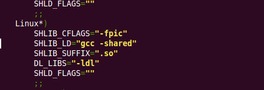

- Move to ns2 directory
::
  
  cd /home/cnc/ns-allinone-2.34 

.. note::

    Check your own path, in this documentation we use /home/cnc/ 

- Install ns2
::

  ./install

- When the installation succed it will be like this

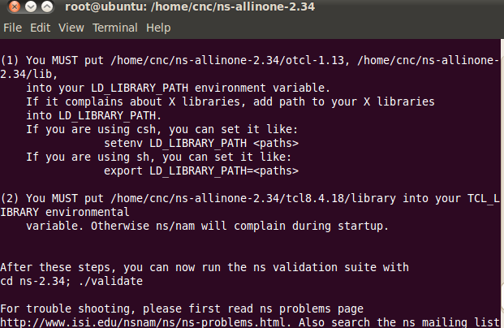

- Edit bashrc
::

  nano ~/.bashrc

- Add this to bashrc
::

  # LD_LIBRARY_PATH
  OTCL_LIB=/home/cnc/ns-allinone-2.34/otcl-1.13
  NS2_LIB=/home/cnc/ns-allinone-2.34/lib
  X11_LIB=/usr/X11R6/lib
  USR_LOCAL_LIB=/usr/local/lib
  export LD_LIBRARY_PATH=$LD_LIBRARY_PATH:$OTCL_LIB:$NS2_LIB:$X11_LIB:$USR_LOCAL_LIB
  # TCL_LIBRARY
  TCL_LIB=/home/cnc/ns-allinone-2.34/tcl8.4.18/library
  USR_LIB=/usr/lib
  export TCL_LIBRARY=$TCL_LIB:$USR_LIB
  # PATH
  XGRAPH=/home/cnc/ns-allinone-2.34/bin:/home/cnc/ns-allinone-2.34/tcl8.4.18/unix:/home/cnc/ns-allinone-2.34/tk8.4.18/unix
  NS=/home/cnc/ns-allinone-2.34/ns-2.34/
  NAM=/home/cnc/ns-allinone-2.34/nam-1.14/
  PATH=$PATH:$XGRAPH:$NS:$NAM

- Source
::

  source ~/.bashrc

- check ns-ver
::

  ns

  ns-ver

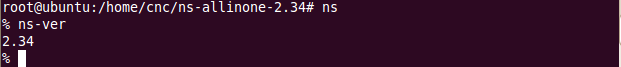

- Download and run simple script from http://nile.wpi.edu/NS/Example/ns-simple.tcl
::

  ns ns-simple.tcl

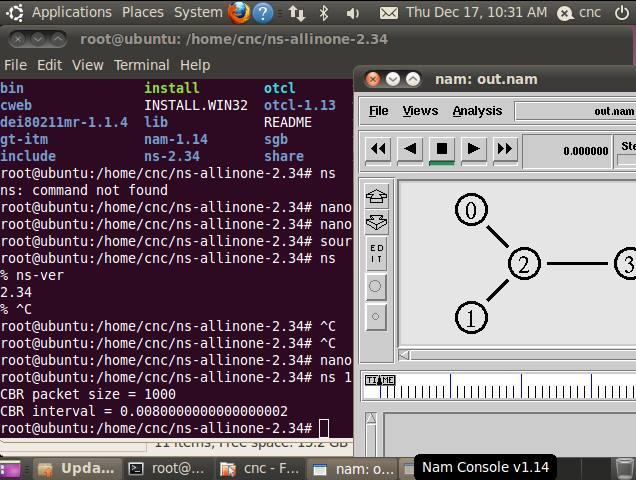

**3. NS 2.33**
*************

- Root access
::

	sudo su

- Re-synchronize the package index files from sources 
::

      apt-get update	

- Extract the tar.gz file
::

  tar -xvf ns-allinone-2.33.tar.gz 

.. note::

    Check the directory which ns-allinone-2.33.tar.gz downloaded 

- Install packages
::

  sudo apt-get install build-essential autoconf automake libxmu-dev

- Open file in otcl-1.13/configure
::

  nano +5518 /home/cnc/ns-allinone-2.33/otcl-1.13/configure

- Replace SHLIB_LD="ld -shared" into SHLIB_LD="gcc -shared"

- Patch for NAM [2]
::

  cd /home/cnc/ns-allinone-2.33/tk8.4.18

- Create a document
::

  nano tk-8.4-lastevent.patch

- Patch for NAM from https://sources.gentoo.org/cgi-bin/viewvc.cgi/gentoo-x86/dev-lang/tk/files/tk-8.4-lastevent.patch?revision=1.1. Paste and save the code below to tk-8.4-lastevent.patch that we just created

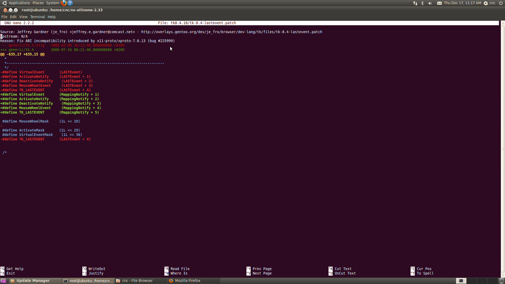
  
- To apply the patch
::

  patch -p0 < ./tk-8.4-lastevent.patch

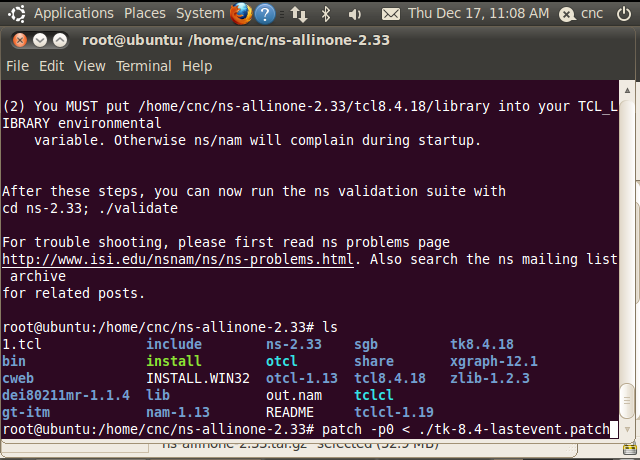

- Move to ns2 directory
::
  
  cd /home/cnc/ns-allinone-2.33 

.. note::

    Check your own path, in this documentation we use /home/cnc/ 

- Install ns2
::

  ./install

- When the installation succed it will be like this

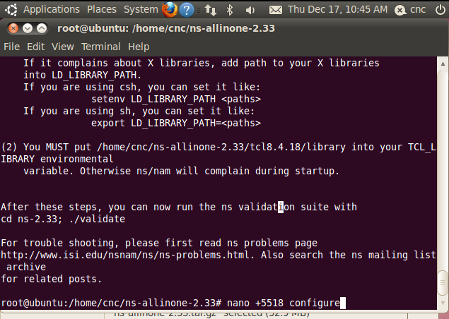

- Edit bashrc
::

  nano ~/.bashrc

- Add this to bashrc
::

  # LD_LIBRARY_PATH
  OTCL_LIB=/home/cnc/ns-allinone-2.33/otcl-1.13
  NS2_LIB=/home/cnc/ns-allinone-2.33/lib
  X11_LIB=/usr/X11R6/lib
  USR_LOCAL_LIB=/usr/local/lib
  export LD_LIBRARY_PATH=$LD_LIBRARY_PATH:$OTCL_LIB:$NS2_LIB:$X11_LIB:$USR_LOCAL_LIB
  # TCL_LIBRARY
  TCL_LIB=/home/cnc/ns-allinone-2.33/tcl8.4.18/library
  USR_LIB=/usr/lib
  export TCL_LIBRARY=$TCL_LIB:$USR_LIB
  # PATH
  XGRAPH=/home/cnc/ns-allinone-2.33/bin:/home/cnc/ns-allinone-2.33/tcl8.4.18/unix:/home/cnc/ns-allinone-2.33/tk8.4.18/unix
  NS=/home/cnc/ns-allinone-2.33/ns-2.33/
  NAM=/home/cnc/ns-allinone-2.33/nam-1.13/
  PATH=$PATH:$XGRAPH:$NS:$NAM

- Source
::

  source ~/.bashrc

- check ns-ver
::

  ns

  ns-ver

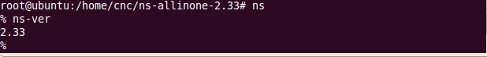

- Download and run simple script from http://nile.wpi.edu/NS/Example/ns-simple.tcl
::

  ns ns-simple.tcl

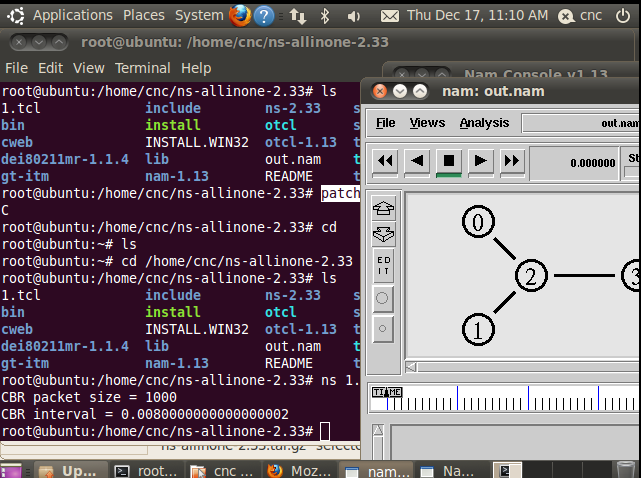

**4. NS 2.32**
*************

- Root access
::

	sudo su

- Re-synchronize the package index files from sources 
::

      apt-get update	

- Extract the tar.gz file
::

  tar -xvf ns-allinone-2.32.tar.gz 

.. note::

    Check the directory which ns-allinone-2.32.tar.gz downloaded 

- Install packages
::

  sudo apt-get install build-essential autoconf automake libxmu-dev

- Open file in otcl-1.13/configure
::

  nano +5516 /home/cnc/ns-allinone-2.32/otcl-1.13/configure

- Replace SHLIB_LD="ld -shared" into SHLIB_LD="gcc -shared"

- Patch for NAM [2]
::

  cd /home/cnc/ns-allinone-2.32/tk8.4.15

- Create a document
::

  nano tk-8.4-lastevent.patch

- Patch for NAM from https://sources.gentoo.org/cgi-bin/viewvc.cgi/gentoo-x86/dev-lang/tk/files/tk-8.4-lastevent.patch?revision=1.1. Paste and save the code below to tk-8.4-lastevent.patch that we just created

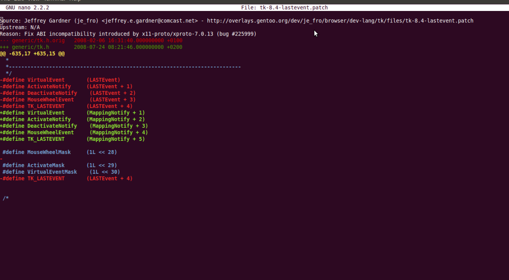
  
- To apply the patch
::

  patch -p0 < ./tk-8.4-lastevent.patch

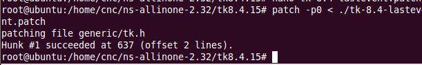

.. note::

    Check your own path, in this documentation we use /home/cnc/ 

- Move to ns2 directory
::
  
  cd /home/cnc/ns-allinone-2.32 

- Install ns2
::

  ./install

- When the installation succed it will be like this

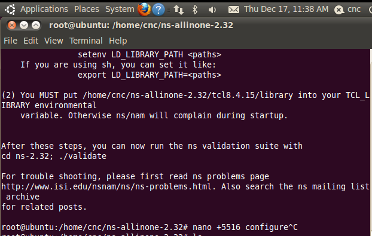

- Edit bashrc
::

  nano ~/.bashrc

- Add this to bashrc
::

  # LD_LIBRARY_PATH
  OTCL_LIB=/home/cnc/ns-allinone-2.32/otcl-1.13
  NS2_LIB=/home/cnc/ns-allinone-2.32/lib
  X11_LIB=/usr/X11R6/lib
  USR_LOCAL_LIB=/usr/local/lib
  export LD_LIBRARY_PATH=$LD_LIBRARY_PATH:$OTCL_LIB:$NS2_LIB:$X11_LIB:$USR_LOCAL_LIB
  # TCL_LIBRARY
  TCL_LIB=/home/cnc/ns-allinone-2.32/tcl8.4.15/library
  USR_LIB=/usr/lib
  export TCL_LIBRARY=$TCL_LIB:$USR_LIB
  # PATH
  XGRAPH=/home/cnc/ns-allinone-2.32/bin:/home/cnc/ns-allinone-2.32/tcl8.4.15/unix:/home/cnc/ns-allinone-2.32/tk8.4.15/unix
  NS=/home/cnc/ns-allinone-2.32/ns-2.32/
  NAM=/home/cnc/ns-allinone-2.32/nam-1.13/
  PATH=$PATH:$XGRAPH:$NS:$NAM

- Source
::

  source ~/.bashrc

- check ns-ver
::

  ns

  ns-ver

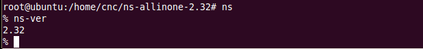

- Download and run simple script from http://nile.wpi.edu/NS/Example/ns-simple.tcl
::

  ns ns-simple.tcl

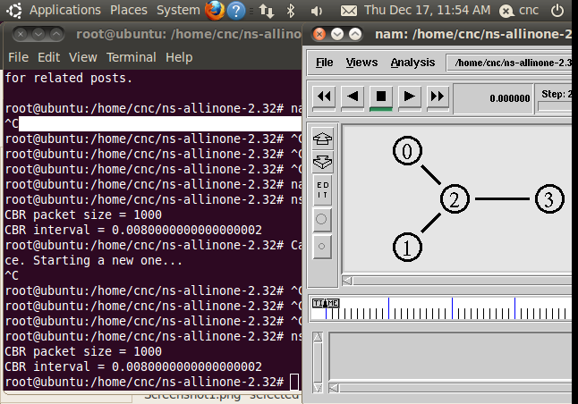

**5. NS 2.31**
*************

- Root access
::

	sudo su

- Re-synchronize the package index files from sources 
::

      apt-get update	

- Extract the tar.gz file
::

  tar -xvf ns-allinone-2.34.tar.gz 

.. note::

    Check the directory which ns-allinone-2.34.tar.gz downloaded 

- Install packages
::

  sudo apt-get install build-essential autoconf automake libxmu-dev

- Open file in otcl-1.13/configure
::

  nano +6304 /home/cnc/ns-allinone-2.34/otcl-1.13/configure

- Replace SHLIB_LD="ld -shared" into SHLIB_LD="gcc -shared"

- Move to ns2 directory
::
  
  cd /home/cnc/ns-allinone-2.34 

.. note::

    Check your own path, in this documentation we use /home/cnc/ 

- Install ns2
::

  ./install

- When the installation succed it will be like this

- Edit bashrc
::

  nano ~/.bashrc

- Add this to bashrc
::

  # LD_LIBRARY_PATH
  OTCL_LIB=/home/cnc/ns-allinone-2.31/otcl-1.13
  NS2_LIB=/home/cnc/ns-allinone-2.31/lib
  X11_LIB=/usr/X11R6/lib
  USR_LOCAL_LIB=/usr/local/lib
  export LD_LIBRARY_PATH=$LD_LIBRARY_PATH:$OTCL_LIB:$NS2_LIB:$X11_LIB:$USR_LOCAL_LIB
  # TCL_LIBRARY
  TCL_LIB=/home/cnc/ns-allinone-2.31/tcl8.4.14/library
  USR_LIB=/usr/lib
  export TCL_LIBRARY=$TCL_LIB:$USR_LIB
  # PATH
  XGRAPH=/home/cnc/ns-allinone-2.34/bin:/home/cnc/ns-allinone-2.31/tcl8.4.14/unix:/home/cnc/ns-allinone-2.31/tk8.4.14/unix
  NS=/home/cnc/ns-allinone-2.31/ns-2.31/
  NAM=/home/cnc/ns-allinone-2.31/nam-1.13/
  PATH=$PATH:$XGRAPH:$NS:$NAM

- Source
::

  source ~/.bashrc

- check ns-ver
::

  ns

  ns-ver

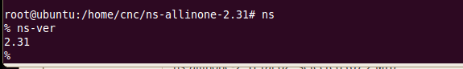

- Download and run simple script from http://nile.wpi.edu/NS/Example/ns-simple.tcl
::

  ns ns-simple.tcl

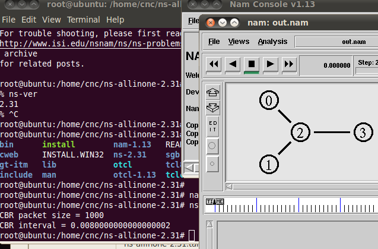

**Sources :**
 - [1] `<http://www.isi.edu/nsnam/ns/>`_
 - [2] `<http://networksimulator-rabin.blogspot.kr/2012/02/network-animator-problem-in-ns233.html>`_
