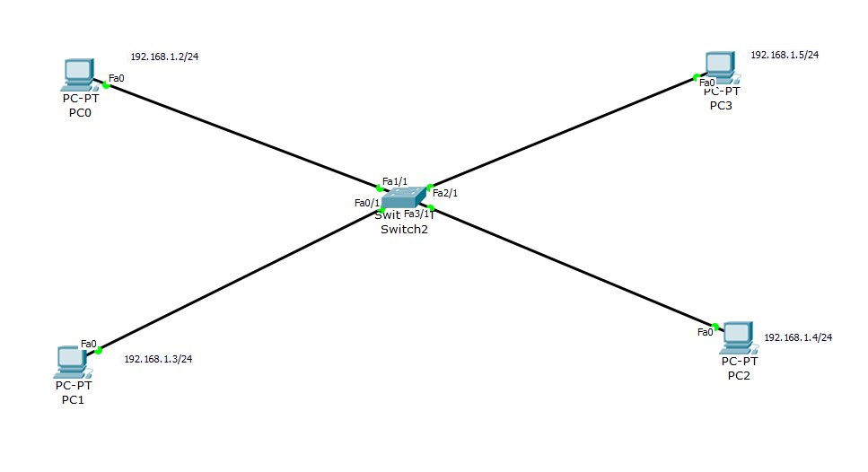
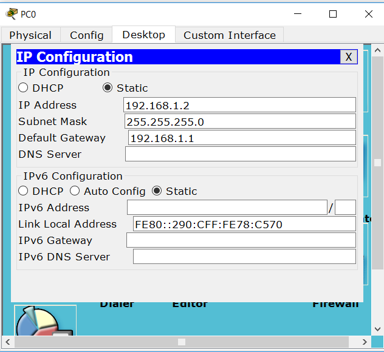
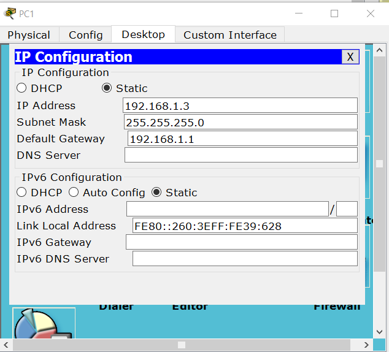
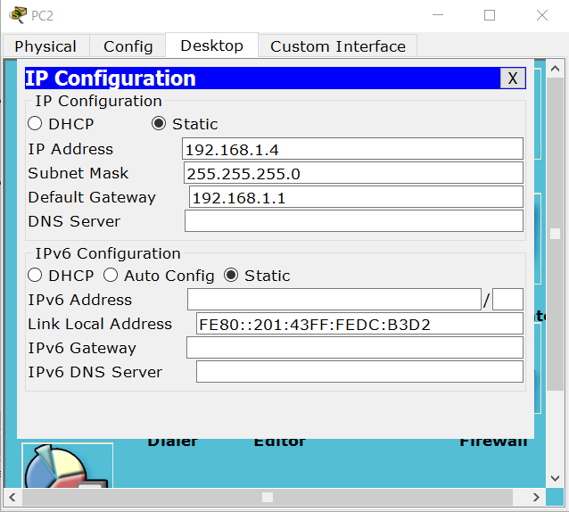
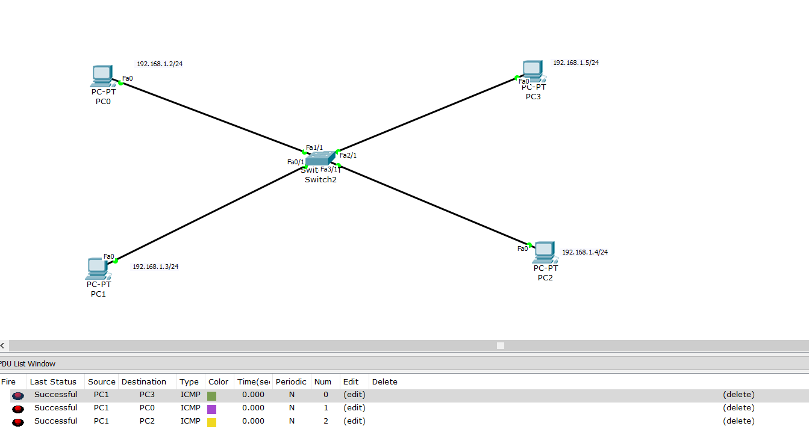
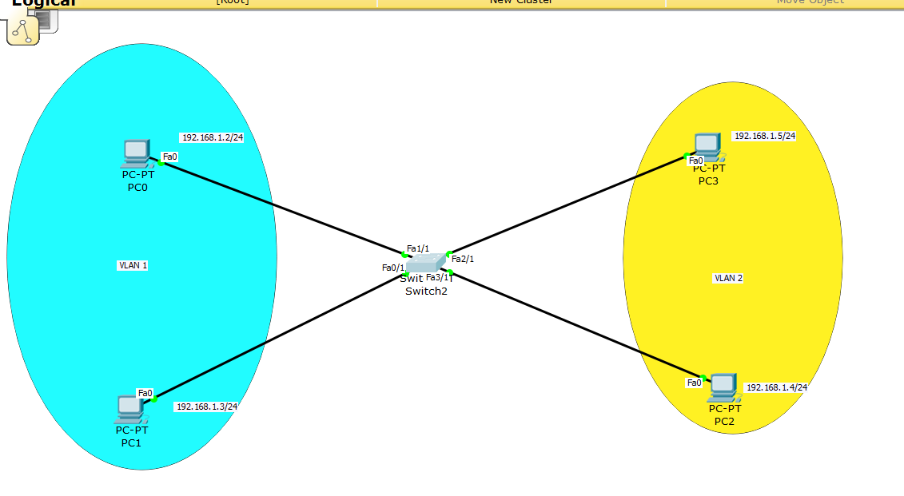

Virtual LAN (VLAN)
==================

.. sidebar:: Documented by :

     * **Code Name**    : NDA
     * **Date** 	: 12/17/2015
     * **Mail** 	: naufal.itt@gmail.com

We use VLAN technology when we want to make a several segment for LAN network. VLAN is configured in switch device. We can also make a group for user depends on the need.

In VLAN theres intra-VLAN and inter-VLAN. Intra-VLAN is when communication happens between host in same VLAN-ID. Inter-VLAN is a communication between host in different VLAN-ID. VLAN 1 is the default if you not configure anything on the switch.

In this documentation we use Cisco Packet Tracer for documentation

1.VLAN part 1
-------------

- First, create this topology in your Cisco Packet Tracer

Set PC ip address to :

	- PC0 ip address

	- PC1 ip address

	- PC2 ip address

	- PC3 ip address

- Do ping to check reachability

After we make sure that they can ping each other, now we make configuration on switch. In this documentation we make vlan topology with VLAN 1 and 2 as an example. 

- Enable
::

	Switch> en
.. image:: 

- Configuration mode
::

	Switch"#"" conf

- Create VLAN 2 (becasue VLAN 1 already created by default)
::

	Switch(config) "#" VLAN 2

- Name your VLAN 2
::

	Switch(config-vlan)#name example
	S

- Make PC3 into VLAN 2 group
::

	Switch(config)#	int f2/1
	Switch(config-if)# switchport mode access
	Switch(config-if)# switchport access vlan 2

- Make PC2 into VLAN 2 group
::

	Switch(config)#	int fa3/1
	Switch(config-if)# switchport mode access
	Switch(config-if)# switchport access vlan 2

.. note::

		Look carefully at your interface, it might be different with this example

- Now try to ping PC in different VLAN-ID, it should be failed.

**Sources :**
 * Modul CnC SPC Network 2014

